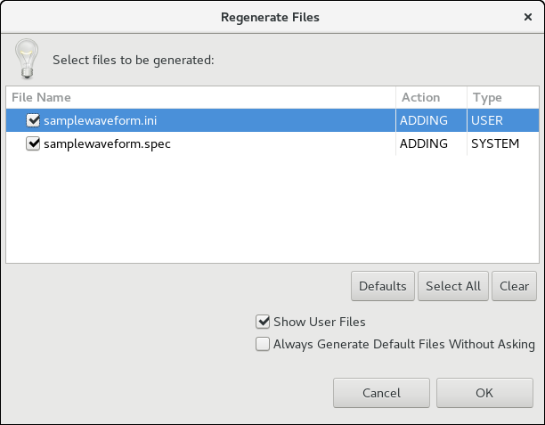

# REDHAWK Waveform Service

This section explains how to manage a single REDHAWK <abbr title="See Glossary.">waveform</abbr> <abbr title="See Glossary.">service</abbr>.  For additional information on managing service configurations and life cycle management, refer to [Domain Manager Service](../../../appendices/adminservice/redhawkcoreservices/domainmanager.html), [Device Manager Service](../../../appendices/adminservice/redhawkcoreservices/devicemanager.html), and [Managing Entire Domains ](../../../appendices/adminservice/redhawkcoreservices/domains.html).


### Creating a Waveform Service Configuration Using the `rhadmin` Script

To create a waveform service configuration, enter the following command:

```sh
rhadmin config waveform >  <output file>.ini
```
A sample configuration is created, which requires the `DOMAIN_NAME` and `WAVEFORM` configuration properties and the section's name to be specified. The section name may be used with `rhadmin` commands. For additional configuration property settings, refer to the [Waveform Configuration File](../../../appendices/adminservice/configuration/waveform.html) . For the file to be recognized by the AdminService, the file must have an .ini extension and be installed into the proper service directory: `/etc/redhawk/waveforms.d`.

#### Creating a Waveform Service Configuration Using the REDHAWK IDE

1. In the REDHAWK IDE, to create a configuration file, click the Generate Waveform button in the Software Assembly Descriptor (SAD) editor.


2. In the Regenerate Files dialog, check the checkbox next to the .ini file to generate it. If the .spec file is also checked, the generated .spec file will include the installation of the .ini file.


### Displaying a Configuration

To display the current configuration for a service, enter the following command:

```sh
rhadmin getconfig  <Domain Name>:<section name>
```

### Starting a Service

Starting a waveform service will install the <abbr title="See Glossary.">Application Factory</abbr> in the <abbr title="See Glossary.">Domain Manager</abbr> and then start the waveform. To start a single waveform service, enter the following command:

```sh
rhadmin start <Domain Name>:<section name>
```

### Stopping a Service

To stop a single waveform service, enter the following command:

```sh
rhadmin stop <Domain Name>:<section name>
```

### Requesting Status of a Service

To status a single waveform service, enter the following command:

```sh
rhadmin status <Domain Name>:<section name>
```

### Restarting a Service

To restart a single waveform service, enter the following command:

```sh
rhadmin restart <Domain Name>:<section name>
```


### Example Session

The following example creates, activates, starts, and status a waveform service for the <abbr title="See Glossary.">domain</abbr>, `REDHAWK_PROD`, which is identified by the section name `controller`.

```sh
# generate a waveform configuration file
rhadmin config waveform >  redhawk_prod_controller.ini

# edit the ini file and change waveform1 to controller in [waveform:waveform1],
# and set the following properties: DOMAIN_NAME=REDHAWK_PROD, WAVEFORM=controller
vi redhawk_prod_controller.ini

cp redhawk_prod_controller.ini /etc/redhawk/waveforms.d

rhadmin update REDHAWK_PROD
rhadmin start REDHAWK_PROD:controller
rhadmin status REDHAWK_PROD:controller

# produces the following output
REDHAWK_PROD:controller              RUNNING   pid 3456, uptime 0:00:10
```
